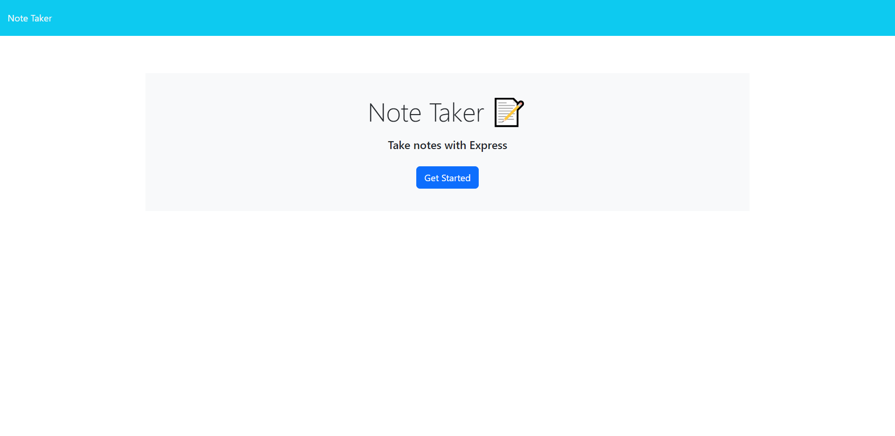
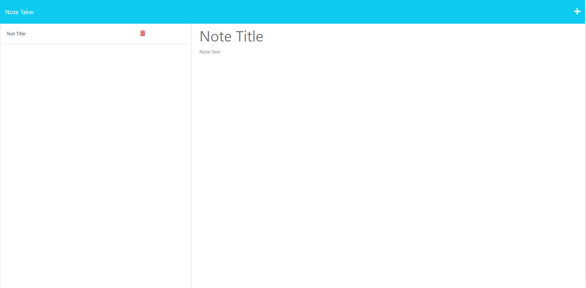

# Express-all-aboard

  ## Description

  This Express-all-aboard was created for boot camp students who were going through Module 11. It contains a note taker application that can save your notes, pull them up, and delete them.

  ## Table of Contents

  * [Installation](#installation)
  * [Usage](#usage)
  * [License](#license)
  * [Screenshots](#screenshots)
  * [Contributing](#contributing)
  * [Tests](#tests)

  ## Installation

  Node Inquirer 8.2.4, nodejs, and express

  ## Usage

  The app is used through commands in the terminal. Enter node server.js into the terminal, and open your browser with the localhost link provided. It will then take you to a web application that contains a get started button. Once clicked, it will take the user to the note page, where the user can write in note titles and text, and save it. The user can also pull their previously written notes from the left column into the right column. To write a new note, clicked the plus button in the top right corner. Click the save button to save the note. Click the red trash can next to each written note to delete the note.

  ## License

    N/A
  ## Screenshots

  [screencastify](https://drive.google.com/file/d/1_E98hca4T4P-60rDpqPW2xUhX15Q4EuB/view)

  
  

  ## Contributing

  Special thanks to Emma, Big Mike, Patricia, Bryan, and Shawn for guiding me through this experience!

  ## Tests

  node server.js

  ## Questions

  If you have any questions, please email me at seafoodude@gmail.com! Visit my [GitHub profile](https://github.com/seafoodude) to view my projects!